# 第4章   微分与差分方程模型

## TodoList 1

```julia
using SymPy  # 导入SymPy符号计算库

# 定义符号变量
@syms t k1 c  # 定义符号变量t(时间)、k1(代谢率常数)和c(初始酒精含量)

m = SymFunction("m")  # 定义符号函数m(t)表示体内酒精含量

# 建立微分方程
eq = Eq(diff(m(t), t) + k1*m(t), 0)  # dm/dt + k1*m = 0

# 求解微分方程,设定初始条件m(0) = c
sol = dsolve(eq, m(t), ics=Dict(m(0) => c))

@show sol # 显示解
```

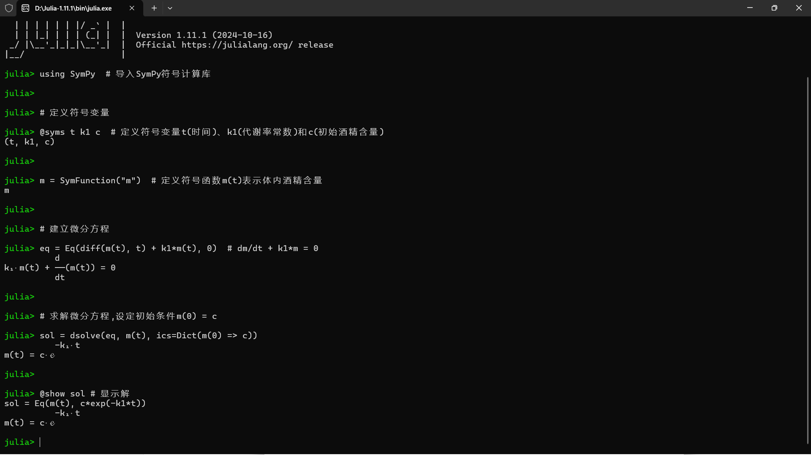

## TodoList 2

```julia
using SymPy
using Plots
plotlyjs()  # 使用 PlotlyJS 后端
# using PlotlyJS 和 plotlyjs() 第一次在环境中运行会出错，这属于 Julia-1.11.1 版本的一个错误，可以在 startup.jl 下预先加载再使用 plotlyjs() 防止报错

# 定义符号变量t（时间）
@syms t

# 定义符号函数m(t)和x(t)，分别表示胃肠道和血液中的酒精含量
m = SymFunction("m")
x = SymFunction("x")

# 求解胃肠道中酒精含量的微分方程
m_eq = dsolve(Eq(diff(m(t), t) + 0.1851*m(t), 0), m(t), ics=Dict(m(0) => 737.7661))
@show m_eq

# 求解血液中酒精含量的微分方程
x_eq = dsolve(Eq(diff(x(t), t) - 130.5155*exp(-0.1950*t) + 1.8537*x(t), 0), x(t), ics=Dict(x(0) => 18.6360))
@show x_eq

# 创建时间序列
t_values = 0:0.1:24  # 0到24小时，步长0.1

# 定义数值计算函数
function numeric_eval(expr, t_val)
    return N(expr.subs(t, t_val))
end

# 计算m和x在不同时间点的值
m_values = [Float64(numeric_eval(m_eq.rhs, tv)) for tv in t_values]
x_values = [Float64(numeric_eval(x_eq.rhs, tv)) for tv in t_values]

# 绘制图形
p = Plots.plot(t_values, m_values, 
    label="胃肠道酒精含量", 
    xlabel="时间 (小时)", 
    ylabel="酒精含量", 
    title="酒精含量随时间变化",
    linewidth=2,
    legend=:topright
)
Plots.plot!(p, t_values, x_values, 
    label="血液酒精含量",
    linewidth=2
)

# 保存图像为HTML文件
Plots.savefig(p, "alcohol_content_plot.html")

```

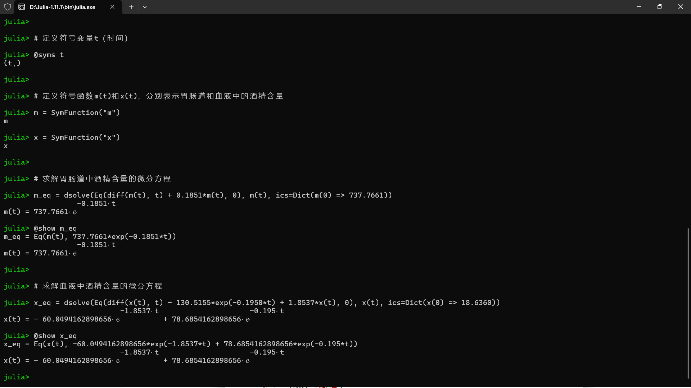

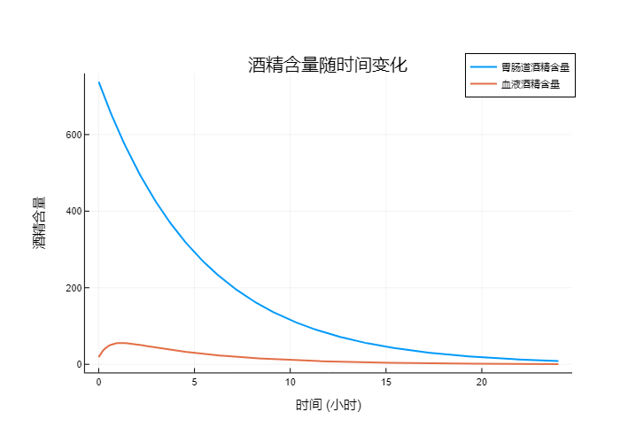

## TodoList 3

```julia
using SymPy
using Plots
plotlyjs()  # 使用 PlotlyJS 后端

# 定义符号变量
@syms i alpha t i0

# 定义符号函数i(t)表示患病人数比例
i = SymFunction("i")

# 解微分方程 di/dt = alpha * i * (1-i)，初始条件 i(0) = i0
i_eq = dsolve(Eq(diff(i(t), t) - alpha*i(t)*(1-i(t)), 0), i(t), ics=Dict(i(0) => i0))
println("微分方程的解：")
println(i_eq)

# 定义函数myfun1(x)，对应MATLAB中的myfun1.m文件
myfun1(x) = 0.01 * x * (1 - x)

# 绘制myfun1函数图像
p1 = Plots.plot(myfun1, 0, 1, 
    label="myfun1(x)", 
    xlabel="x 值", 
    ylabel="y 值", 
    title="函数 myfun1(x) = 0.01x(1-x) 的图像",
    linewidth=2,
    legend=:topright)

# 保存myfun1的图像
Plots.savefig(p1, "myfun1_plot.html")

# 设置参数值
alpha_val = 0.5
i0_val = 0.01

# 创建函数来计算i(t)的值
i_func(t_val) = float(i_eq.rhs.subs([(alpha, alpha_val), (i0, i0_val), (t, t_val)]))

# 创建时间序列
t_values = 0:0.1:30

# 计算i(t)在不同时间点的值
i_values = [i_func(t) for t in t_values]

# 绘制i(t)的图像
p2 = Plots.plot(t_values, i_values, 
    label="i(t)", 
    xlabel="时间 t", 
    ylabel="患病人数比例 i", 
    title="患病人数比例 i(t) 随时间的变化",
    linewidth=2,
    legend=:bottomright)

# 保存i(t)的图像
Plots.savefig(p2, "i_t_plot.html")

```

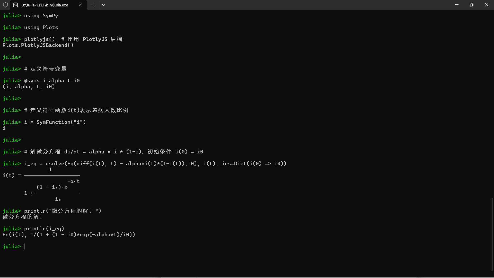

<div style="display: flex; justify-content: center; align-items: center; gap: 20px;">
  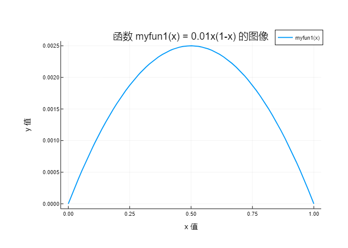
  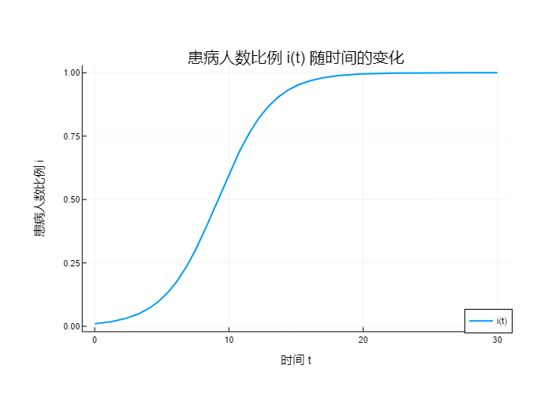
</div>

## TodoList 4

```julia
using SymPy
using Plots
plotlyjs()  # 使用 PlotlyJS 后端

# 定义符号变量
@syms i alpha t i0

# 定义符号函数i(t)表示患病人数比例
i = SymFunction("i")

# 解微分方程 di/dt = alpha * i * (1-i)，初始条件 i(0) = i0
i_eq = dsolve(Eq(diff(i(t), t) - alpha*i(t)*(1-i(t)), 0), i(t), ics=Dict(i(0) => i0))

# 打印方程的解
println("微分方程的解：")
println(i_eq)

# 简化解的表达式
i_eq_simplified = simplify(i_eq.rhs)
println("\n简化后的解：")
println(i_eq_simplified)

# 设置参数值
alpha_val = 0.5
i0_val = 0.01

# 定义函数来计算i(t)的值
i_func(t_val) = 1 / (1 - exp(-alpha_val * t_val) * (-1 + i0_val) / i0_val)

# 创建时间序列
t_values = 0:0.1:30

# 计算i(t)在不同时间点的值
i_values = [i_func(t) for t in t_values]

# 绘制i(t)的图像
p = Plots.plot(t_values, i_values, 
    label="患病人数比例", 
    xlabel="时间 t", 
    ylabel="患病人数比例 i", 
    title="患病人数比例i(t)随时间的变化",
    linewidth=2,
    legend=:topright
)

# 计算拐点（增长速度最大点）
t_inflection = log(1/i0_val - 1) / alpha_val
println("\n增长速度最大点: t ≈ ", t_inflection)

# 在图中标记拐点
i_inflection = i_func(t_inflection)
Plots.scatter!([t_inflection], [i_inflection], label="拐点", markersize=8, color=:red)
Plots.annotate!([(t_inflection, i_inflection, Plots.text("拐点", :red, :bottom))])

# 保存图像为HTML文件
Plots.savefig(p, "patient_proportion_plot.html")

```

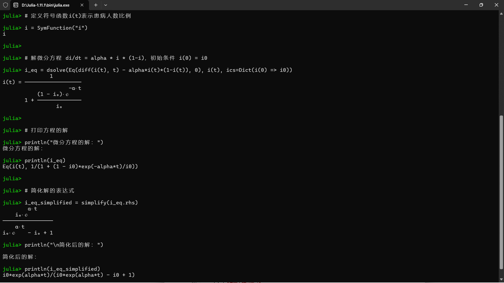

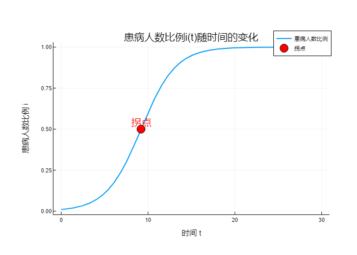

## TodoList 5

```julia
using SymPy  # 导入SymPy符号计算库

# 定义符号变量
@syms t alpha sigma i0  # 定义符号变量

i = SymFunction("i")  # 定义符号函数i(t)表示感染率

# 建立微分方程
eq = Eq(diff(i(t), t), -alpha * i(t) * (i(t) - (1 - 1/sigma)))

# 求解微分方程,设定初始条件i(0) = i0
sol = dsolve(eq, i(t), ics=Dict(i(0) => i0))

# 显示解
@show sol

# 简化解（可选）
simplified_sol = simplify(rhs(sol))
println("\n简化后的解：")
println(simplified_sol)

```

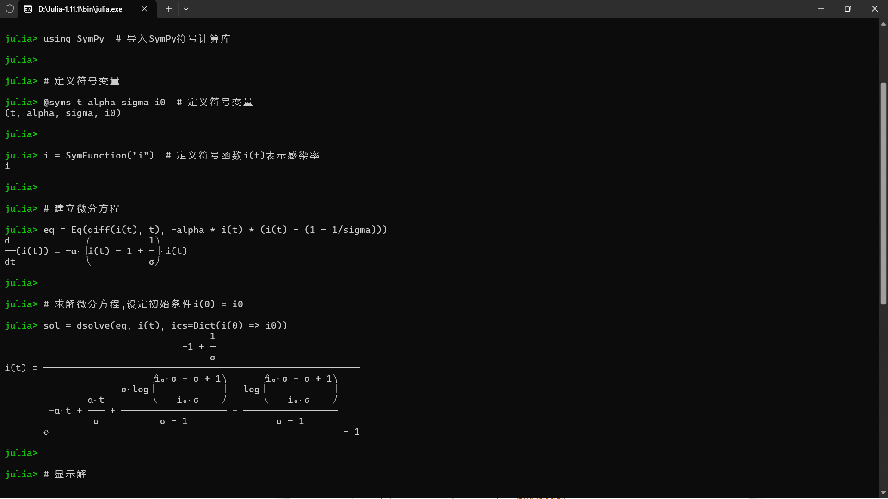

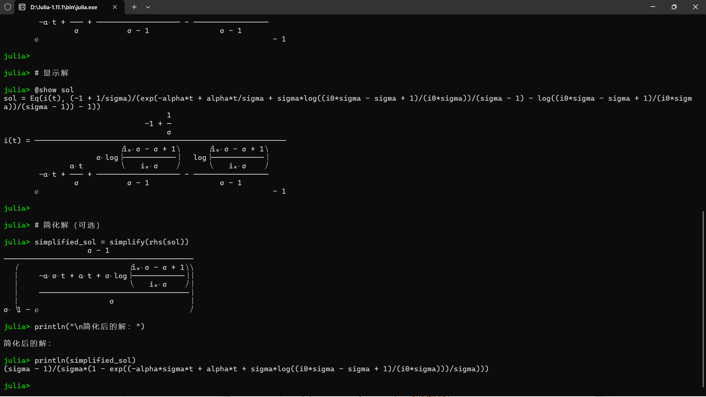

## TodoList 6

```julia
using DifferentialEquations
using Plots
plotlyjs() # 使用 PlotlyJS 后端

# 定义 SIR 模型的微分方程
function sir!(du, u, p, t)
    s, i, r = u
    α, β = p
    du[1] = -α * s * i         # ds/dt: 易感人群变化率
    du[2] = α * s * i - β * i  # di/dt: 感染人群变化率
    du[3] = β * i              # dr/dt: 康复人群变化率
end

# 设置模型参数
α, β = 1.0, 0.3  # α: 感染率, β: 康复率
p = [α, β]

# 设置初始条件
s0, i0, r0 = 0.98, 0.02, 0.0  # 初始易感人群、感染人群和康复人群比例
u0 = [s0, i0, r0]

# 设置时间跨度
tspan = (0.0, 50.0)

# 定义 ODE 问题
prob = ODEProblem(sir!, u0, tspan, p)

# 求解 ODE 问题
sol = solve(prob)

# 绘制时间序列图
p1 = Plots.plot(sol, idxs=[1,2,3], label=["Susceptible" "Infected" "Recovered"], 
                title="SIR Model Time Series", xlabel="Time", ylabel="Population Ratio",
                size=(800, 500))
Plots.annotate!(p1, [(25, 0.6, "S: Susceptible"), (25, 0.3, "I: Infected"), (25, 0.1, "R: Recovered")])

# 保存时间序列图为 HTML 格式
Plots.savefig(p1, "sir_model_time_series.html")

# 绘制相图
p2 = Plots.plot(sol, idxs=(1,2), label="Phase Trajectory", 
                title="SIR Model Phase Plot", xlabel="Susceptible", ylabel="Infected",
                size=(800, 500))
Plots.annotate!(p2, [(0.5, 0.15, "Direction of time")])
Plots.quiver!(p2, [0.5], [0.15], quiver=([0.1], [0]), color=:black)

# 保存相图为 HTML 格式
Plots.savefig(p2, "sir_model_phase_plot.html")

```

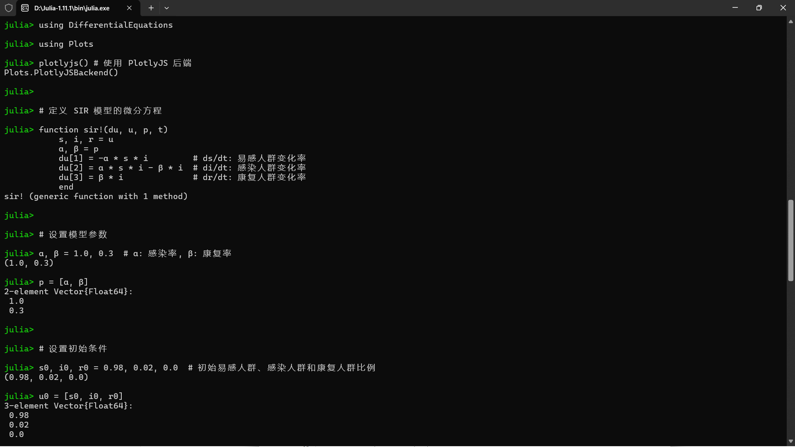

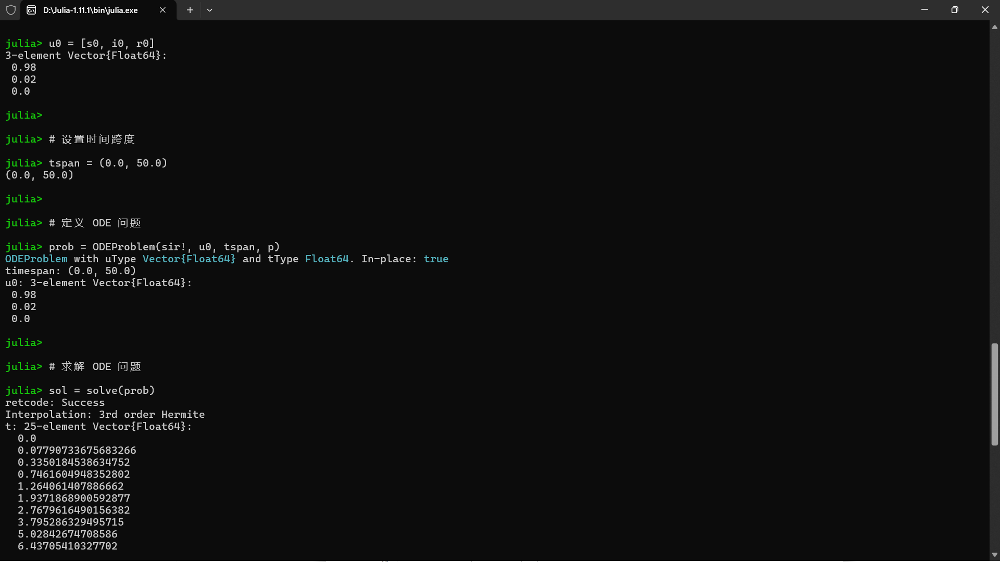

<div style="display: flex; justify-content: center; align-items: center; gap: 20px;">
  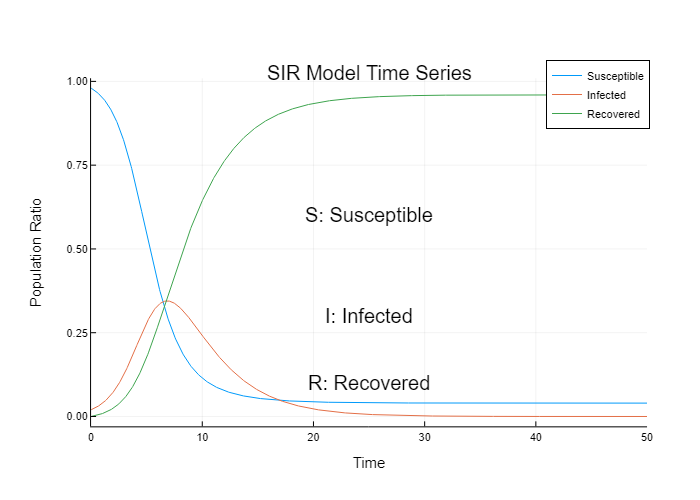
  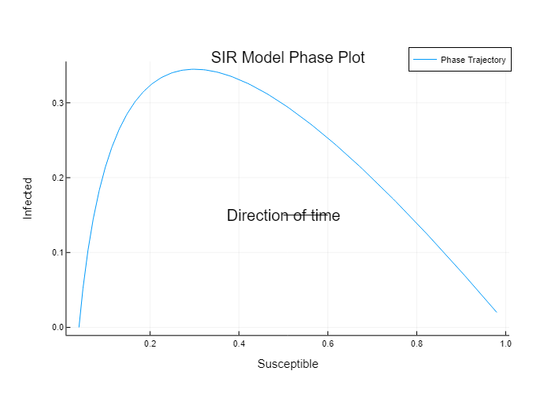
</div>

## TodoList 7

```julia
# 导入必要的包
using DifferentialEquations  # 用于解微分方程
using Plots                  # 用于绘图
plotlyjs()                   # 使用 PlotlyJS 后端进行绘图

# 定义微分方程系统
function xt!(du, u, p, t)
    # 设定模型参数
    p1, p2, r1, r2, N1, N2 = 0.5, 0.6, 2.5, 1.8, 1.6, 1.0
    # 种群 1 的微分方程
    du[1] = r1 * u[1] * (1 - u[1]/N1 - p1*u[2]/N2)
    # 种群 2 的微分方程
    du[2] = r2 * u[2] * (1 - u[2]/N2 - p2*u[1]/N1)
end

# 设定时间跨度
tspan = (0.0, 10.0)

# 设定第一组初始条件 [0.1, 0.1] 并求解
prob1 = ODEProblem(xt!, [0.1, 0.1], tspan)
sol1 = solve(prob1)

# 设定第二组初始条件 [1.0, 2.0] 并求解
prob2 = ODEProblem(xt!, [1.0, 2.0], tspan)
sol2 = solve(prob2)

# 绘制第一个初始条件的时间序列图
p1 = Plots.plot(sol1, idxs=(0,[1,2]), title="Initial: [0.1, 0.1]", 
                xlabel="t", ylabel="Population", label=["x(t)" "y(t)"])
Plots.savefig(p1, "time_series_1.html")  # 保存图形为HTML文件

# 绘制第二个初始条件的时间序列图
p2 = Plots.plot(sol2, idxs=(0,[1,2]), title="Initial: [1.0, 2.0]", 
                xlabel="t", ylabel="Population", label=["x(t)" "y(t)"])
Plots.savefig(p2, "time_series_2.html")  # 保存图形为HTML文件

# 绘制相轨线图
p3 = Plots.plot(sol1, idxs=(1,2), label="Initial: [0.1, 0.1]", xlabel="x", ylabel="y")
Plots.plot!(p3, sol2, idxs=(1,2), label="Initial: [1.0, 2.0]")
# 在相轨线图上标记起始点
Plots.scatter!(p3, [0.1], [0.1], label="Start [0.1, 0.1]", marker=:diamond)
Plots.scatter!(p3, [1.0], [2.0], label="Start [1.0, 2.0]", marker=:circle)
Plots.title!(p3, "甲乙种群相轨线")
Plots.savefig(p3, "phase_portrait_for_7.html")  # 保存图形为HTML文件

```

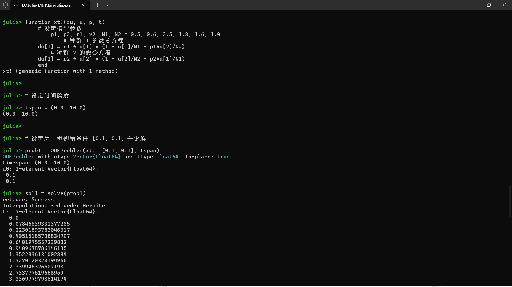

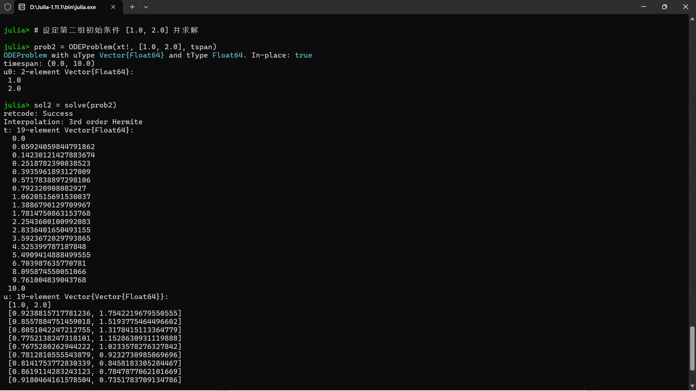

<div style="display: flex; justify-content: center; align-items: center; gap: 20px;">
  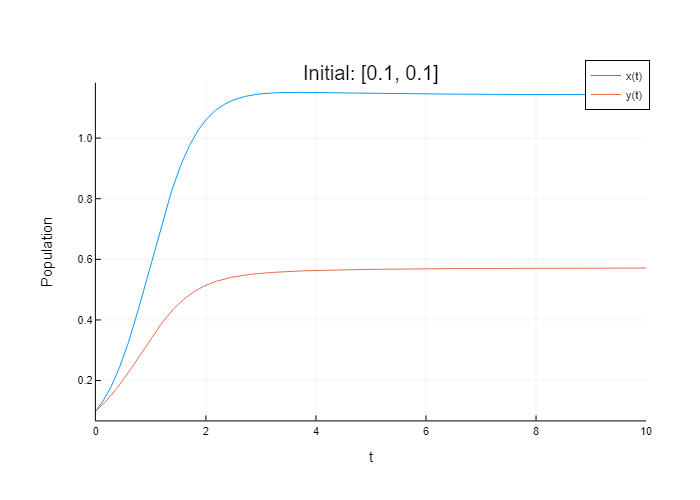
  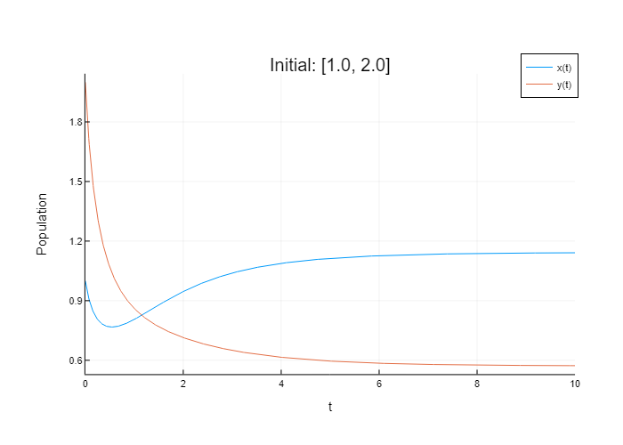
</div>

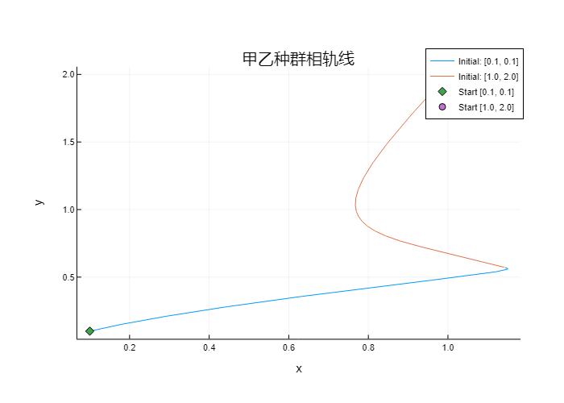

## TodoList 8

```julia
using DifferentialEquations  # 用于解微分方程
using Plots                  # 用于绘图
Plots.plotlyjs()             # 使用 PlotlyJS 后端进行绘图

# 定义微分方程系统
function zhuiqiu!(du, u, p, t)
    a, b, r = 0.5, 0.1, 0.3  # 设定参数值
    du[1] = (a - b*u[2]) * u[1]   # x 的微分方程
    du[2] = (-r + b*u[1]) * u[2]  # y 的微分方程
end

# 设定时间跨度和初始条件
tspan = (0.0, 50.0)  # 时间范围从 0 到 50
x0 = [5.0, 2.0]      # 初始条件 [x(0), y(0)]

# 创建并求解微分方程问题
prob = ODEProblem(zhuiqiu!, x0, tspan)
sol = solve(prob)

# 绘制时间序列图
p1 = Plots.plot(sol, idxs=(0,[1,2]), 
                xlabel="t", ylabel="Population", 
                label=["x(t)" "y(t)"], 
                title="Time Series", 
                grid=true)

# 保存时间序列图为 HTML 文件
Plots.savefig(p1, "time_series.html")

# 绘制相轨线图
p2 = Plots.plot(sol, idxs=(1,2), 
                xlabel="x", ylabel="y", 
                label="Phase Portrait", 
                title="Phase Portrait", 
                grid=true)

# 在相轨线图上标记起始点
Plots.scatter!(p2, [x0[1]], [x0[2]], label="Start", marker=:circle)

# 保存相轨线图为 HTML 文件
Plots.savefig(p2, "phase_portrait_for_8.html")

```

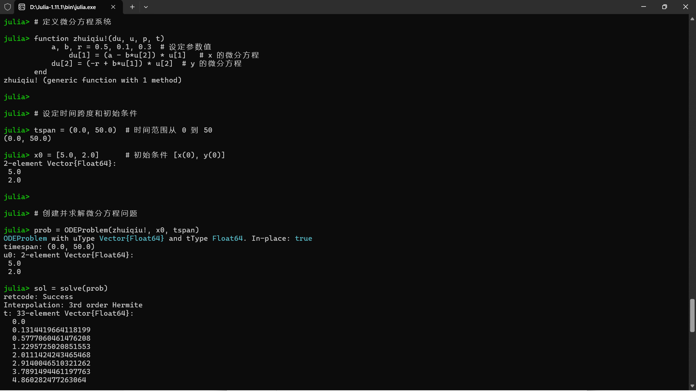

<div style="display: flex; justify-content: center; align-items: center; gap: 20px;">
  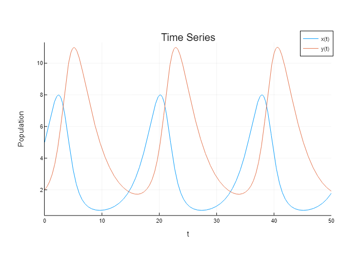
  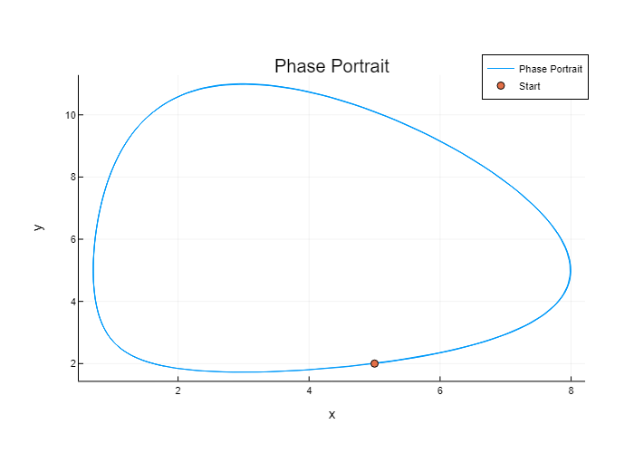
</div>
